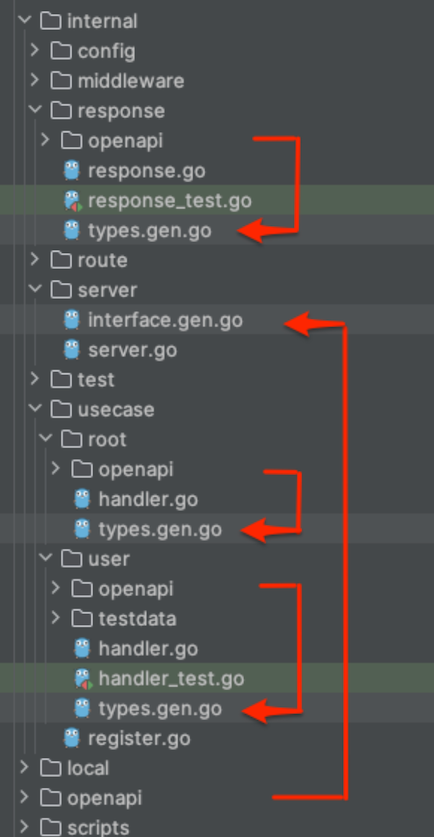

# chi-api

An example application to demonstrate my approach in organising Go API using Chi router

## Code organisation

Routes and handlers are organised vertically in `usecase` package.

This project uses Chi sub router to define 2 different types of routes: public and protected.
Protected routes use a simple [auth middleware](internal/middleware/auth.go) that verifies incoming request bearer token against a static token

Each use case handler exposes a method `Routes()` (from [Routable interface](internal/route/routable.go))
so that route declaration (what routes available) is separated from route registration (protected routes are registered to protected sub router).
Route registration is done in [register.go](internal/usecase/register.go)

## OpenAPI

This project follows schema-driven approach and uses [oapi-codegen](github.com/deepmap/oapi-codegen) to generate code from OpenAPI schema

Each use case has its own OpenAPI schema file that defines routes and types used in that use case.
Use case OpenAPI schema files (and supporting files) are stored in sub-directory `openapi` in each use case package

These use case OpenAPI schema files are merged together using [redocly cli](https://redocly.com/docs/cli/commands/join/)
to become project-level OpenAPI schema file at `/openapi/spec.yaml`. This project level schema is used to generate
`/internal/server/interface.gen.go`.

[Stoplight Elements](https://stoplight.io/open-source/elements) is used as OpenAPI schema UI
